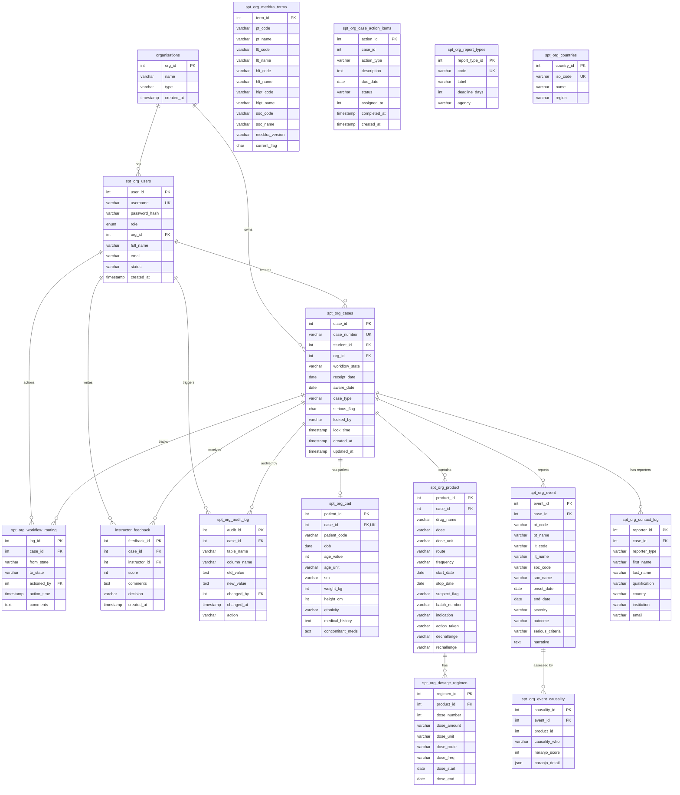

# PharmaVigil – Database Schema Reference

> **Database:** PostgreSQL  
> **ORM:** Prisma  
> **Schema file:** [`prisma/schema.prisma`](../prisma/schema.prisma)

---

## Table of Contents

- [Entity-Relationship Diagram](#entity-relationship-diagram)
- [Table Reference](#table-reference)
  - [organisations](#organisations)
  - [spt_org_users](#spt_org_users)
  - [spt_org_cases](#spt_org_cases)
  - [spt_org_cad (Patient)](#spt_org_cad-patient)
  - [spt_org_product](#spt_org_product)
  - [spt_org_dosage_regimen](#spt_org_dosage_regimen)
  - [spt_org_event](#spt_org_event)
  - [spt_org_event_causality](#spt_org_event_causality)
  - [spt_org_contact_log (Reporter)](#spt_org_contact_log-reporter)
  - [spt_org_meddra_terms](#spt_org_meddra_terms)
  - [spt_org_workflow_routing](#spt_org_workflow_routing)
  - [spt_org_case_action_items](#spt_org_case_action_items)
  - [instructor_feedback](#instructor_feedback)
  - [spt_org_audit_log](#spt_org_audit_log)
  - [spt_org_report_types](#spt_org_report_types)
  - [spt_org_countries](#spt_org_countries)

---

## Entity-Relationship Diagram

---

## Table Reference

### organisations

The top-level tenant.  Each college or institution is an organisation.

| Column       | Type         | Constraints        | Notes                    |
| ------------ | ------------ | ------------------ | ------------------------ |
| `org_id`     | `serial`     | PK, auto-increment |                          |
| `name`       | `varchar(200)` | NOT NULL          |                          |
| `type`       | `varchar(50)` | DEFAULT `'COLLEGE'` | COLLEGE, UNIVERSITY, etc. |
| `created_at` | `timestamp`  | DEFAULT `now()`    |                          |

---

### spt_org_users

Application users – students, instructors, and admins.

| Column          | Type          | Constraints          | Notes                         |
| --------------- | ------------- | -------------------- | ----------------------------- |
| `user_id`       | `serial`      | PK                   |                               |
| `username`      | `varchar(100)` | UNIQUE, NOT NULL    |                               |
| `password_hash` | `varchar(255)` | NOT NULL            | bcrypt hash                   |
| `role`          | `enum`        | NOT NULL             | STUDENT, INSTRUCTOR, ADMIN    |
| `org_id`        | `int`         | FK → organisations   |                               |
| `full_name`     | `varchar(200)` | NOT NULL            |                               |
| `email`         | `varchar(200)` | NOT NULL            |                               |
| `status`        | `varchar(20)` | DEFAULT `'ACTIVE'`   | ACTIVE, INACTIVE              |
| `created_at`    | `timestamp`   | DEFAULT `now()`      |                               |

---

### spt_org_cases

Individual Case Safety Reports (ICSRs).

| Column           | Type          | Constraints         | Notes                         |
| ---------------- | ------------- | ------------------- | ----------------------------- |
| `case_id`        | `serial`      | PK                  |                               |
| `case_number`    | `varchar(30)` | UNIQUE, NOT NULL    | Auto-generated: PV-YYYY-NNNNNN |
| `student_id`     | `int`         | FK → spt_org_users  |                               |
| `org_id`         | `int`         | FK → organisations  |                               |
| `workflow_state` | `varchar(30)` | DEFAULT `'DRAFT'`   | See [WORKFLOW.md](./WORKFLOW.md) |
| `receipt_date`   | `date`        | nullable            |                               |
| `aware_date`     | `date`        | nullable            |                               |
| `case_type`      | `varchar(30)` | nullable            | Report type code              |
| `serious_flag`   | `char(1)`     | DEFAULT `'N'`       | Y or N                       |
| `locked_by`      | `varchar(100)` | nullable           | Optimistic locking            |
| `lock_time`      | `timestamp`   | nullable            |                               |
| `created_at`     | `timestamp`   | DEFAULT `now()`     |                               |
| `updated_at`     | `timestamp`   | Auto-updated        |                               |

---

### spt_org_cad (Patient)

One patient per case (1:1 relationship).

| Column            | Type          | Constraints       | Notes         |
| ----------------- | ------------- | ----------------- | ------------- |
| `patient_id`      | `serial`      | PK                |               |
| `case_id`         | `int`         | UNIQUE FK → cases |               |
| `patient_code`    | `varchar(20)` | nullable          |               |
| `dob`             | `date`        | nullable          |               |
| `age_value`       | `int`         | nullable          |               |
| `age_unit`        | `varchar(10)` | nullable          | YEAR, MONTH   |
| `sex`             | `varchar(10)` | nullable          | M, F, UNKNOWN |
| `weight_kg`       | `int`         | nullable          |               |
| `height_cm`       | `int`         | nullable          |               |
| `ethnicity`       | `varchar(50)` | nullable          |               |
| `medical_history` | `text`        | nullable          |               |
| `concomitant_meds`| `text`        | nullable          |               |

---

### spt_org_product

Suspect and concomitant drugs associated with a case.

| Column         | Type           | Constraints     | Notes                              |
| -------------- | -------------- | --------------- | ---------------------------------- |
| `product_id`   | `serial`       | PK              |                                    |
| `case_id`      | `int`          | FK → cases      |                                    |
| `drug_name`    | `varchar(200)` | NOT NULL        |                                    |
| `dose`         | `varchar(50)`  | nullable        |                                    |
| `dose_unit`    | `varchar(20)`  | nullable        |                                    |
| `route`        | `varchar(50)`  | nullable        | ORAL, IV, IM, SC, TOPICAL, etc.    |
| `frequency`    | `varchar(50)`  | nullable        | QD, BID, TID, etc.                |
| `start_date`   | `date`         | nullable        |                                    |
| `stop_date`    | `date`         | nullable        |                                    |
| `suspect_flag` | `varchar(20)`  | DEFAULT `'SUSPECT'` | SUSPECT, CONCOMITANT, INTERACTING |
| `batch_number` | `varchar(100)` | nullable        |                                    |
| `indication`   | `varchar(300)` | nullable        |                                    |
| `action_taken` | `varchar(50)`  | nullable        | WITHDRAWN, REDUCED, CONTINUED      |
| `dechallenge`  | `varchar(50)`  | nullable        |                                    |
| `rechallenge`  | `varchar(50)`  | nullable        |                                    |

---

### spt_org_dosage_regimen

Detailed dosage steps for a product (1:N from product).

| Column        | Type          | Constraints     | Notes |
| ------------- | ------------- | --------------- | ----- |
| `regimen_id`  | `serial`      | PK              |       |
| `product_id`  | `int`         | FK → product    |       |
| `dose_number` | `int`         | DEFAULT `1`     |       |
| `dose_amount` | `varchar(50)` | nullable        |       |
| `dose_unit`   | `varchar(20)` | nullable        |       |
| `dose_route`  | `varchar(50)` | nullable        |       |
| `dose_freq`   | `varchar(50)` | nullable        |       |
| `dose_start`  | `date`        | nullable        |       |
| `dose_end`    | `date`        | nullable        |       |

---

### spt_org_event

Adverse events / reactions recorded for a case.

| Column             | Type           | Constraints | Notes                          |
| ------------------ | -------------- | ----------- | ------------------------------ |
| `event_id`         | `serial`       | PK          |                                |
| `case_id`          | `int`          | FK → cases  |                                |
| `pt_code`          | `varchar(20)`  | nullable    | MedDRA Preferred Term          |
| `pt_name`          | `varchar(300)` | nullable    |                                |
| `llt_code`         | `varchar(20)`  | nullable    | MedDRA Lowest Level Term       |
| `llt_name`         | `varchar(300)` | nullable    |                                |
| `soc_code`         | `varchar(20)`  | nullable    | System Organ Class             |
| `soc_name`         | `varchar(300)` | nullable    |                                |
| `onset_date`       | `date`         | nullable    |                                |
| `end_date`         | `date`         | nullable    |                                |
| `severity`         | `varchar(30)`  | nullable    | MILD, MODERATE, SEVERE         |
| `outcome`          | `varchar(50)`  | nullable    | RECOVERED, FATAL, etc.         |
| `serious_criteria` | `varchar(200)` | nullable    | Comma-separated criteria codes |
| `narrative`        | `text`         | nullable    | Free-text event narrative      |

---

### spt_org_event_causality

Drug–event causality assessments (Naranjo, WHO-UMC).

| Column           | Type          | Constraints | Notes                      |
| ---------------- | ------------- | ----------- | -------------------------- |
| `causality_id`   | `serial`      | PK          |                            |
| `event_id`       | `int`         | FK → event  |                            |
| `product_id`     | `int`         |             | References product         |
| `causality_who`  | `varchar(30)` | nullable    | WHO-UMC category           |
| `naranjo_score`  | `int`         | nullable    | 0-13                       |
| `naranjo_detail` | `json`        | nullable    | Question-by-question answers |

---

### spt_org_contact_log (Reporter)

Reporters / contacts associated with a case.

| Column          | Type           | Constraints | Notes                   |
| --------------- | -------------- | ----------- | ----------------------- |
| `reporter_id`   | `serial`       | PK          |                         |
| `case_id`       | `int`          | FK → cases  |                         |
| `reporter_type` | `varchar(50)`  | nullable    | PHYSICIAN, PHARMACIST, CONSUMER, OTHER |
| `first_name`    | `varchar(100)` | nullable    |                         |
| `last_name`     | `varchar(100)` | nullable    |                         |
| `qualification` | `varchar(100)` | nullable    |                         |
| `country`       | `varchar(100)` | nullable    |                         |
| `institution`   | `varchar(200)` | nullable    |                         |
| `email`         | `varchar(200)` | nullable    |                         |

---

### spt_org_meddra_terms

MedDRA terminology dictionary (loaded separately via `scripts/load-meddra.js`).

| Column           | Type           | Constraints | Notes          |
| ---------------- | -------------- | ----------- | -------------- |
| `term_id`        | `serial`       | PK          |                |
| `pt_code`        | `varchar(20)`  | NOT NULL    | Indexed        |
| `pt_name`        | `varchar(300)` | NOT NULL    | Indexed        |
| `llt_code`       | `varchar(20)`  | nullable    |                |
| `llt_name`       | `varchar(300)` | nullable    | Indexed        |
| `hlt_code`       | `varchar(20)`  | nullable    |                |
| `hlt_name`       | `varchar(300)` | nullable    |                |
| `hlgt_code`      | `varchar(20)`  | nullable    |                |
| `hlgt_name`      | `varchar(300)` | nullable    |                |
| `soc_code`       | `varchar(20)`  | nullable    |                |
| `soc_name`       | `varchar(300)` | nullable    |                |
| `meddra_version` | `varchar(10)`  | DEFAULT `'26.1'` |          |
| `current_flag`   | `char(1)`      | DEFAULT `'Y'` |              |

---

### spt_org_workflow_routing

Audit trail of all workflow state transitions.

| Column         | Type          | Constraints    | Notes        |
| -------------- | ------------- | -------------- | ------------ |
| `log_id`       | `serial`      | PK             |              |
| `case_id`      | `int`         | FK → cases     |              |
| `from_state`   | `varchar(30)` | nullable       | null = created |
| `to_state`     | `varchar(30)` | NOT NULL       |              |
| `actioned_by`  | `int`         | FK → users     |              |
| `action_time`  | `timestamp`   | DEFAULT `now()` |             |
| `comments`     | `text`        | nullable       |              |

---

### spt_org_case_action_items

Follow-up actions and to-do items for cases.

| Column         | Type           | Constraints      | Notes                |
| -------------- | -------------- | ---------------- | -------------------- |
| `action_id`    | `serial`       | PK               |                      |
| `case_id`      | `int`          |                  |                      |
| `action_type`  | `varchar(100)` | NOT NULL         |                      |
| `description`  | `text`         | nullable         |                      |
| `due_date`     | `date`         | nullable         |                      |
| `status`       | `varchar(20)`  | DEFAULT `'OPEN'` | OPEN, DONE, CANCELLED |
| `assigned_to`  | `int`          | nullable         |                      |
| `completed_at` | `timestamp`    | nullable         |                      |
| `created_at`   | `timestamp`    | DEFAULT `now()`  |                      |

---

### instructor_feedback

Instructor reviews and scoring of student cases.

| Column          | Type          | Constraints      | Notes                           |
| --------------- | ------------- | ---------------- | ------------------------------- |
| `feedback_id`   | `serial`      | PK               |                                 |
| `case_id`       | `int`         | FK → cases       |                                 |
| `instructor_id` | `int`         | FK → users       |                                 |
| `score`         | `int`         | nullable         | 0-100                           |
| `comments`      | `text`        | nullable         |                                 |
| `decision`      | `varchar(30)` | nullable         | APPROVE, REJECT, REQUEST_CHANGES |
| `created_at`    | `timestamp`   | DEFAULT `now()`  |                                 |

---

### spt_org_audit_log

Full change audit trail for regulatory compliance.

| Column        | Type          | Constraints       | Notes               |
| ------------- | ------------- | ----------------- | ------------------- |
| `audit_id`    | `serial`      | PK                |                     |
| `case_id`     | `int`         | FK → cases (nullable) |                 |
| `table_name`  | `varchar(50)` | NOT NULL          |                     |
| `column_name` | `varchar(100)`| nullable          |                     |
| `old_value`   | `text`        | nullable          |                     |
| `new_value`   | `text`        | nullable          |                     |
| `changed_by`  | `int`         | FK → users        |                     |
| `changed_at`  | `timestamp`   | DEFAULT `now()`   |                     |
| `action`      | `varchar(10)` | DEFAULT `'UPDATE'` | INSERT, UPDATE, DELETE |

---

### spt_org_report_types

Lookup table for pharmacovigilance report type classifications.

| Column           | Type           | Constraints      | Notes      |
| ---------------- | -------------- | ---------------- | ---------- |
| `report_type_id` | `serial`       | PK               |            |
| `code`           | `varchar(50)`  | UNIQUE, NOT NULL |            |
| `label`          | `varchar(200)` | NOT NULL         |            |
| `deadline_days`  | `int`          | nullable         |            |
| `agency`         | `varchar(100)` | nullable         |            |

---

### spt_org_countries

ISO 3166-1 country lookup table.

| Column       | Type           | Constraints      | Notes            |
| ------------ | -------------- | ---------------- | ---------------- |
| `country_id` | `serial`       | PK               |                  |
| `iso_code`   | `varchar(3)`   | UNIQUE, NOT NULL | Alpha-3 ISO code |
| `name`       | `varchar(200)` | NOT NULL         |                  |
| `region`     | `varchar(100)` | nullable         | UN region        |
