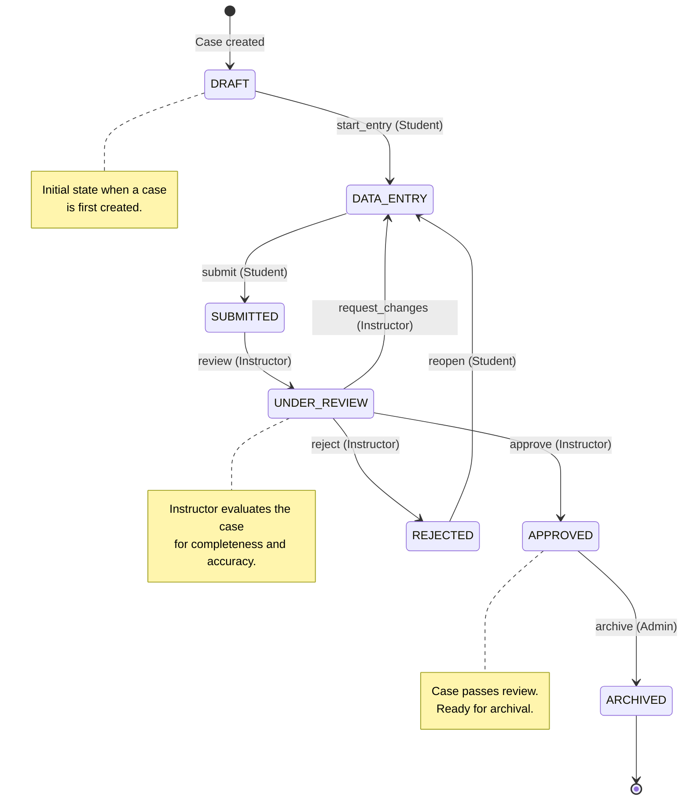

# PharmaVigil – Case Workflow

> This document defines the state machine that governs the lifecycle of an
> Individual Case Safety Report (ICSR) within PharmaVigil.

---

## Table of Contents

- [State Diagram](#state-diagram)
- [States](#states)
- [Transitions](#transitions)
- [Role Permissions](#role-permissions)
- [Business Rules](#business-rules)
- [Workflow Log](#workflow-log)

---

## State Diagram



---

## States

| State          | Description                                                                 |
| -------------- | --------------------------------------------------------------------------- |
| `DRAFT`        | Case has been created but data entry has not started. Minimal data present.  |
| `DATA_ENTRY`   | Student is actively entering case data (patient, drugs, events, narrative). |
| `SUBMITTED`    | Student has completed data entry and submitted the case for review.         |
| `UNDER_REVIEW` | An instructor has picked up the case and is evaluating it.                  |
| `APPROVED`     | Case has passed instructor review and is considered complete.               |
| `REJECTED`     | Case did not pass review. Student can reopen and revise.                    |
| `ARCHIVED`     | Case has been permanently archived. No further edits allowed.               |

---

## Transitions

Each transition is triggered by a named **action** and is restricted to
specific **roles**.

| Action             | From State       | To State         | Role Required | Notes                                    |
| ------------------ | ---------------- | ---------------- | ------------- | ---------------------------------------- |
| `start_entry`      | `DRAFT`          | `DATA_ENTRY`     | STUDENT       | Begins data entry                        |
| `submit`           | `DATA_ENTRY`     | `SUBMITTED`      | STUDENT       | Submits for review                       |
| `review`           | `SUBMITTED`      | `UNDER_REVIEW`   | INSTRUCTOR    | Instructor picks up the case             |
| `approve`          | `UNDER_REVIEW`   | `APPROVED`       | INSTRUCTOR    | Case passes review                       |
| `reject`           | `UNDER_REVIEW`   | `REJECTED`       | INSTRUCTOR    | Case fails review                        |
| `request_changes`  | `UNDER_REVIEW`   | `DATA_ENTRY`     | INSTRUCTOR    | Sent back for revision                   |
| `reopen`           | `REJECTED`       | `DATA_ENTRY`     | STUDENT       | Student reopens to fix issues            |
| `archive`          | `APPROVED`       | `ARCHIVED`       | ADMIN         | Permanent archive                        |

---

## Role Permissions

### Student

- **Can create** new cases (creates in `DRAFT` state)
- **Can edit** cases in `DRAFT` or `DATA_ENTRY` states
- **Can transition:**
  - `DRAFT` → `DATA_ENTRY` (start_entry)
  - `DATA_ENTRY` → `SUBMITTED` (submit)
  - `REJECTED` → `DATA_ENTRY` (reopen)
- **Cannot** edit cases that are `SUBMITTED`, `UNDER_REVIEW`, `APPROVED`, or `ARCHIVED`
- **Can view** only their own cases

### Instructor

- **Can view** all cases within their organisation
- **Can transition:**
  - `SUBMITTED` → `UNDER_REVIEW` (review)
  - `UNDER_REVIEW` → `APPROVED` (approve)
  - `UNDER_REVIEW` → `REJECTED` (reject)
  - `UNDER_REVIEW` → `DATA_ENTRY` (request_changes)
- **Can submit** feedback and scoring on cases
- **Cannot** edit case data directly

### Admin

- **Can view** all cases across all organisations
- **Can transition:**
  - `APPROVED` → `ARCHIVED` (archive)
- **Can manage** users, organisations, and system settings
- **Can view** the full audit log

---

## Business Rules

### DRAFT

- Created automatically when `POST /api/cases` is called
- Contains minimal data (case number auto-generated)
- **Editable:** All fields
- **Deletable:** Yes (hard delete allowed)
- No deadline tracking until entry begins

### DATA_ENTRY

- Student is actively filling in the case form
- **Editable:** All case fields (patient, products, events, reporters)
- **Deletable:** No
- Case is **locked** to the owning student – other students cannot edit
- Student can save progress without submitting
- Must have at minimum: 1 patient record, 1 product, 1 event before submitting

### SUBMITTED

- Case data is frozen (read-only to the student)
- Waiting in the instructor's review queue
- **Editable:** No
- **Deletable:** No
- Timestamp of submission is recorded
- Appears in instructor dashboard under "Pending Review"

### UNDER_REVIEW

- Instructor is evaluating the case
- **Editable:** No (but instructor can add feedback)
- Instructor can:
  - **Approve** — if the case meets quality standards
  - **Reject** — if the case has fundamental issues
  - **Request Changes** — if the case needs corrections
- Feedback (score + comments) should be submitted alongside the decision

### APPROVED

- Case is considered complete and accurate
- **Editable:** No
- **Deletable:** No
- Score and feedback are visible to the student
- Available for archival by an admin
- Counts toward student's completed case tally

### REJECTED

- Case did not meet review standards
- **Editable:** No (until reopened)
- Student can view instructor feedback
- Student can **reopen** the case to return to `DATA_ENTRY`
- When reopened, previous feedback remains attached for reference

### ARCHIVED

- **Terminal state** — no further transitions
- **Editable:** No
- **Deletable:** No
- Case is preserved for audit and compliance purposes
- All audit logs are sealed

---

## Workflow Log

Every state transition is recorded in the `spt_org_workflow_routing` table:

| Field          | Description                              |
| -------------- | ---------------------------------------- |
| `log_id`       | Auto-generated primary key               |
| `case_id`      | The case being transitioned              |
| `from_state`   | Previous state (null for creation)       |
| `to_state`     | New state after transition               |
| `actioned_by`  | User ID who triggered the transition     |
| `action_time`  | Timestamp of the transition              |
| `comments`     | Optional comments/reason for transition  |

### Example Workflow History

```
┌─────┬──────────────┬──────────────┬───────────────┬─────────────────────┐
│ #   │ From         │ To           │ By            │ Time                │
├─────┼──────────────┼──────────────┼───────────────┼─────────────────────┤
│ 1   │ —            │ DRAFT        │ Jane (Student)│ 2024-01-15 10:00    │
│ 2   │ DRAFT        │ DATA_ENTRY   │ Jane (Student)│ 2024-01-15 10:01    │
│ 3   │ DATA_ENTRY   │ SUBMITTED    │ Jane (Student)│ 2024-01-16 14:30    │
│ 4   │ SUBMITTED    │ UNDER_REVIEW │ Dr. Smith     │ 2024-01-17 09:00    │
│ 5   │ UNDER_REVIEW │ DATA_ENTRY   │ Dr. Smith     │ 2024-01-17 09:45    │
│ 6   │ DATA_ENTRY   │ SUBMITTED    │ Jane (Student)│ 2024-01-17 16:00    │
│ 7   │ SUBMITTED    │ UNDER_REVIEW │ Dr. Smith     │ 2024-01-18 10:00    │
│ 8   │ UNDER_REVIEW │ APPROVED     │ Dr. Smith     │ 2024-01-18 10:30    │
│ 9   │ APPROVED     │ ARCHIVED     │ Admin         │ 2024-02-01 12:00    │
└─────┴──────────────┴──────────────┴───────────────┴─────────────────────┘
```

---

## Validation Rules for Submission

Before a case can transition from `DATA_ENTRY` → `SUBMITTED`, the system
validates that the minimum required data is present:

| Check                          | Rule                                     |
| ------------------------------ | ---------------------------------------- |
| Patient data exists            | At least one `spt_org_cad` record        |
| At least one suspect drug      | ≥1 product with `suspect_flag = SUSPECT` |
| At least one adverse event     | ≥1 event record                          |
| Event has MedDRA coding        | `pt_code` or `pt_name` is not empty      |
| Receipt date is set            | `receipt_date` is not null               |

If any validation fails, the transition is rejected with a `422` error
listing the missing items.
